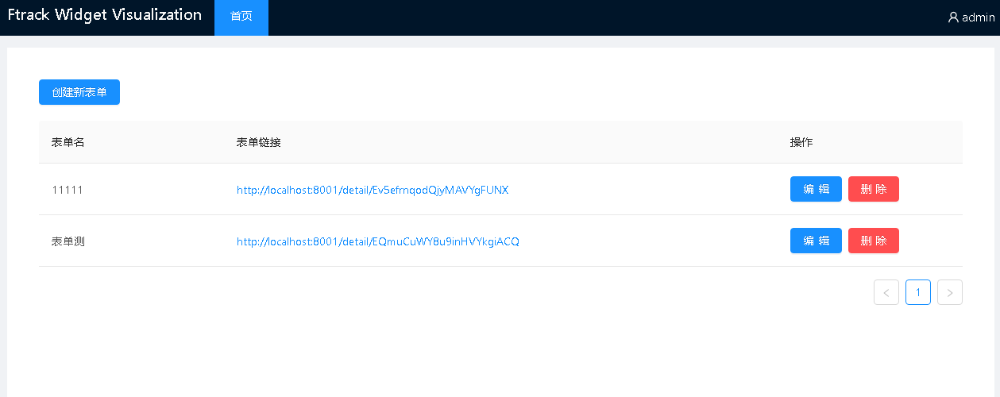
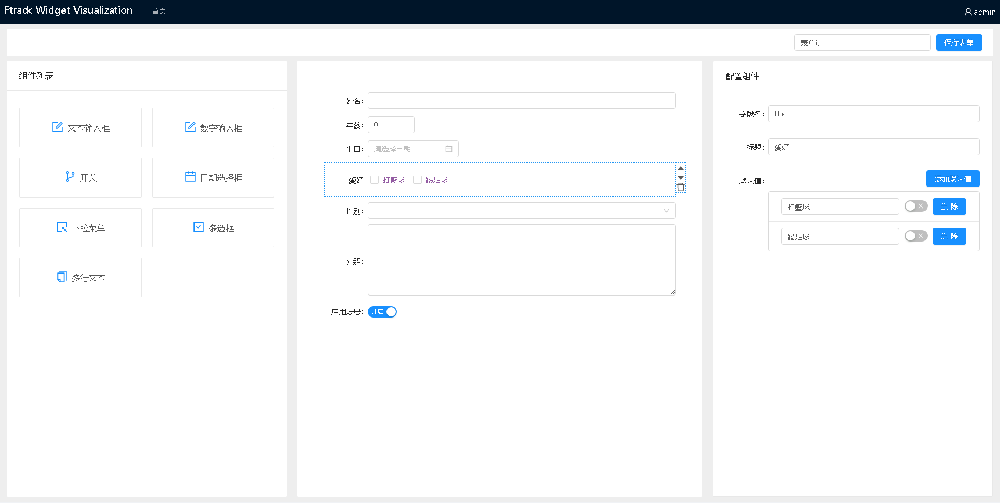
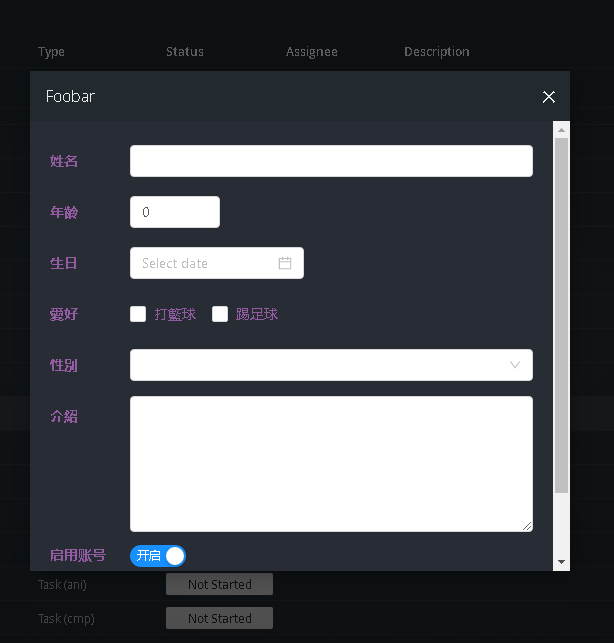

# Ftrack 自定义表单 可视化编辑平台
## 介绍




## 技术栈
Umijs + Flask + MongoDB

## python事件编写
```python
def launch(self, event):
    if not event['data'].get('values'):
        # 将所选对象保存起来，然后在表单返回后取回来
        self.entity_by_id[event['id']] = event['data']['selection']
        return {'type': 'widget',
                'url': 'http://localhost:8001/detail/EQmuCuWY8u9inHVYkgiACQ'
                        # identifier 和 sel_id 是固定字段，用于返回数据，后面的是可以自定义表单的默认值
                       '?identifier={}&sel_id={}&name=xiaowang&sex=1,2&age=18'.format(
                    self._action_id(), event['id']),
                'title': 'Foobar'}

    values = event['data'].get('values')
    selection_id = self.entity_by_id.pop(values.pop('selectionId'))
    print(f'values: {values}')
    print(f'selection: {selection_id}')
```
